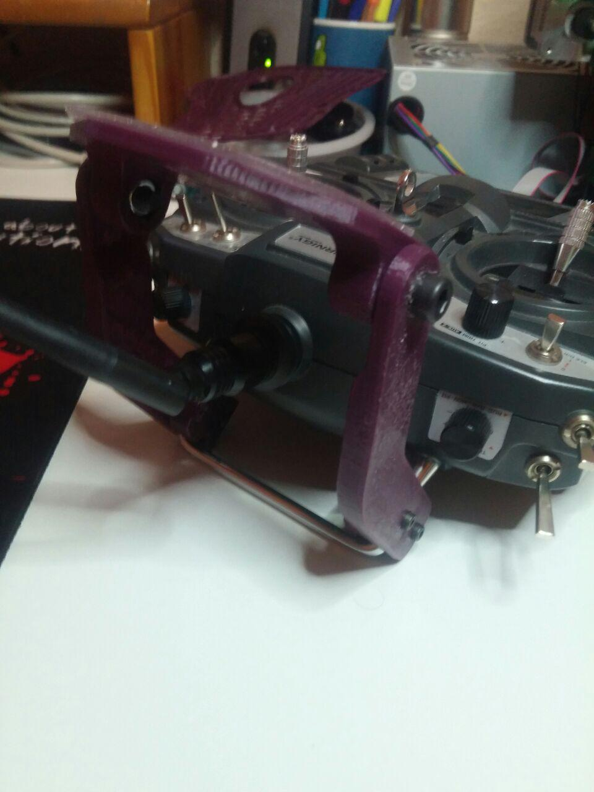
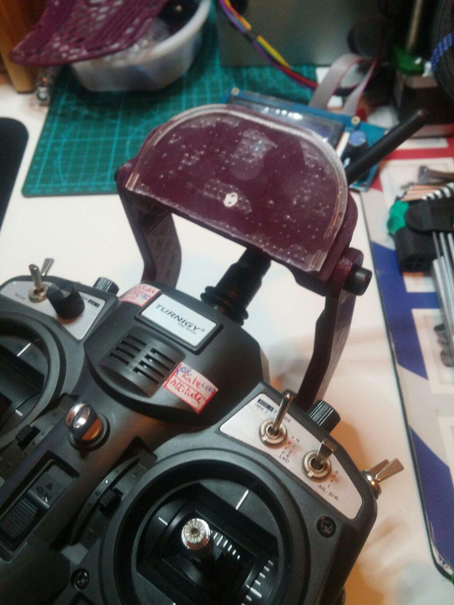

# Turnigy9x phone stand:

Material necesary:
------------------
For mount it, it´s necesary this hardware:

* Two bolts M6x20
* Two nuts M6
* Four bolts M3x10 at least
* A Silicone Vehicle Anti-Slip Mat like this: http://www.dx.com/p/silicone-vehicle-anti-slip-mat-black-126636#.VSweR_msWTM

This model is derived from: http://www.thingiverse.com/thing:349502